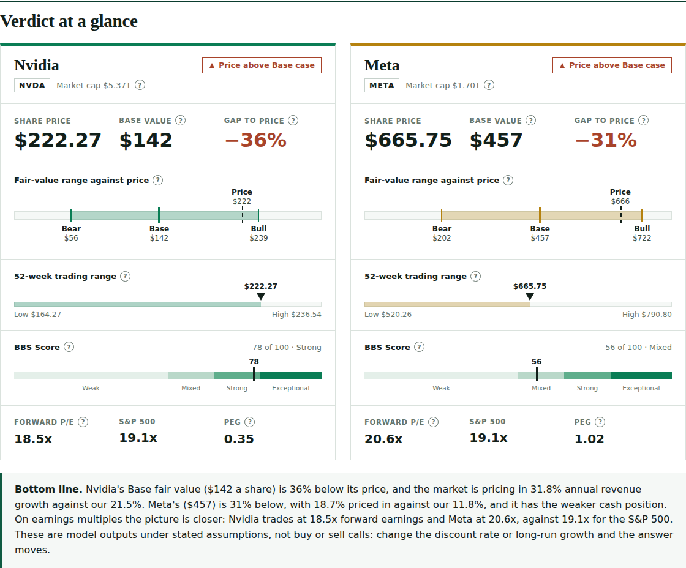

<div align="center">

# Toolkit

**Claude skills, apps and tools for marketing, media, brand and investing.**
Built to connect what marketers know about brands and audiences to the numbers that decide whether a business, a campaign or a stock is worth backing.

[](LICENSE)
[](https://github.com/jay-nair-builds/toolkit/releases)
[](https://github.com/jay-nair-builds/toolkit/commits/main)
[](https://agentskills.io/specification)



</div>

## Catalogue

| Name | Type | Theme | What it does | Status |
|---|---|---|---|---|
| [stock-etf-analysis](skills/stock-etf-analysis/) | Skill | Investing | Fair-value forecast, over or undervalued read, Brand-to-Balance-Sheet score, macro backdrop, pre-mortem, visual scorecard and Excel model | v1.0.0 |

More skills and apps are planned across marketing analytics, media planning, brand health and brand-to-financials tools. They are added here only once they are built and tested.

## Quick start

**Use a skill in Claude.** Download the skill's folder (for example [`skills/stock-etf-analysis`](skills/stock-etf-analysis/)), add it in Claude's skill settings or place it in your skills directory, then ask in plain language: *"Analyse Nvidia and Meta"* or *"Is Unilever undervalued?"*.

**Run the code directly.** Each skill keeps its scripts in its own `scripts/` folder. See the skill's README for the command.

## Repository layout

```
toolkit/
├── skills/                 Claude skills, one folder each, in the Agent Skills format
│   └── <skill-name>/
│       ├── SKILL.md        instructions and metadata (required)
│       ├── README.md       human-readable overview
│       ├── scripts/        code the skill runs
│       ├── references/     longer documentation, loaded on demand
│       └── assets/         templates, examples and screenshots
├── apps/                   standalone apps and dashboards (added when the first one ships)
├── template/               a starter skill to copy
├── .github/                issue and pull request templates
├── CONTRIBUTING.md
├── CHANGELOG.md
└── LICENSE · NOTICE
```

Every skill or app is self-contained in its own folder, so it can be copied out on its own. Each skill states its theme (investing, marketing, media, brand) in the `category` field of its `SKILL.md` metadata and in the catalogue above.

## Contributing

Ideas, bug reports and improvements are welcome. Read [CONTRIBUTING.md](CONTRIBUTING.md) first, and use the [skill template](template/skill-template/) to start a new skill. Please follow the [Code of Conduct](CODE_OF_CONDUCT.md). Report security issues as described in [SECURITY.md](SECURITY.md).

## Licence and credit

Licensed under the [Apache License 2.0](LICENSE): free to use, share and adapt. Keep the [NOTICE](NOTICE) and the credit line **Brand-to-Balance-Sheet (BBS) method by Jay Nair · github.com/jay-nair-builds/toolkit**, which the stock-etf-analysis skill prints on every scorecard, model and brief it produces.

To cite this work, use the "Cite this repository" button on GitHub, which reads [CITATION.cff](CITATION.cff).

## Disclaimer

Everything here is for education. Nothing is investment, legal or tax advice, and nothing is a recommendation to buy, sell or hold any security. Examples use data as of the date shown and are not updated.
