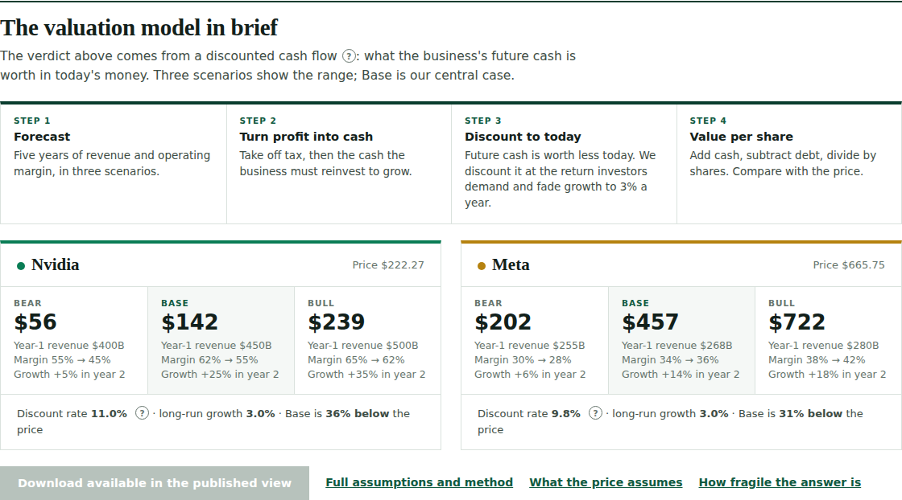
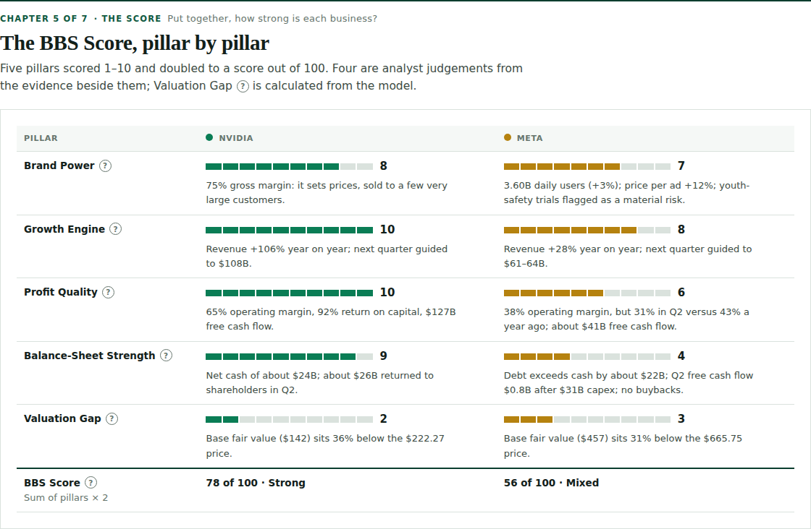
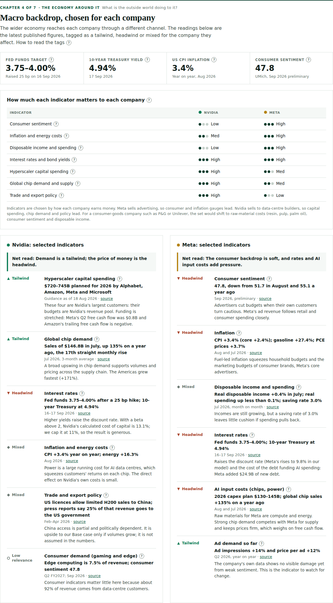
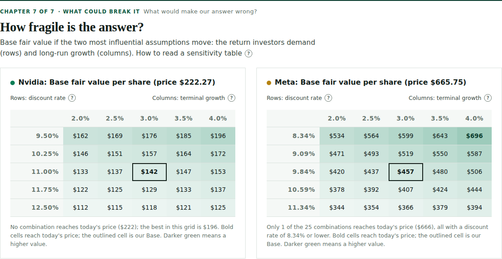

# Stock and ETF analysis: the Brand-to-Balance-Sheet (BBS) method

A Claude skill that values a stock or ETF like a CFA, then presents the result so a non-financial reader can follow it in about a minute.

It answers three questions: **is it under or overvalued, why, and what would prove the answer wrong?**

## What makes it different

| Feature | What you get |
|---|---|
| **Story first, then numbers** | Each scenario starts as a two-sentence story and is turned into explicit forecasts, in the tradition of Aswath Damodaran |
| **Fair value and reverse DCF** | Bear, Base and Bull values per share, plus the growth the current price already assumes |
| **BBS Score, 0 to 100** | Five pillars from brand power to balance sheet: Brand Power, Growth Engine, Profit Quality, Balance-Sheet Strength, Valuation Gap |
| **P/E in context** | Trailing and forward P/E against the S&P 500 and the company's industry, and the P/E implied by the Base value |
| **Macro backdrop, tailored** | Inflation, rates, consumer sentiment, disposable income, input costs and more, chosen and tagged tailwind, headwind or mixed for that company and industry |
| **Portfolio view** | The segments, brands or categories behind the number |
| **Pre-mortem** | Assume the stock is down 40% in three years, then find the most likely reasons, the signal to watch and the level that changes the view |
| **Glossary popovers** | A small "?" beside every metric gives what it is and how it is calculated |
| **Excel model** | Live formulas: cost of capital, scenarios, cash flows, sensitivity, ten-year P&L history and a five-period forecast |

## Output

The skill produces a visual scorecard and an Excel model. The page reads as a story in seven chapters: the brand, the business, the track record, the economy around it, the score, the price, and what could break it.

| | |
|---|---|
|  |  |
|  |  |

## Use it

**In Claude:** add the folder as a skill (upload `SKILL.md` in Claude's skill settings, or place the folder in your skills directory), then ask for example: *"Analyse Nvidia and Meta"* or *"Is Unilever undervalued?"*. The skill pulls current data, so it works best with web search or market data tools switched on.

## Worked example

Nvidia against Meta, prices at close on 18 September 2026. The data is a snapshot and is not updated.

| | Nvidia | Meta |
|---|---|---|
| Price | $222.27 | $665.75 |
| Base fair value | $142 | $457 |
| Bear to Bull | $56 to $239 | $202 to $722 |
| Growth priced in vs Base | 31.8% vs 21.5% a year | 18.7% vs 11.8% a year |
| BBS Score | 78 | 56 |

- [`assets/example/nvda-vs-meta-scorecard.html`](assets/example/nvda-vs-meta-scorecard.html): the scorecard as a static page. Open it in a browser; the download button works only in Claude's published viewer.
- [`assets/example/BBS_Valuation_Model_NVDA_META.xlsx`](assets/example/BBS_Valuation_Model_NVDA_META.xlsx): the Excel model. Change a blue input and the value per share, verdict and BBS Score recalculate.
- [`scripts/engine.py`](scripts/engine.py) and [`scripts/fin.py`](scripts/fin.py): the Python valuation engine and the historical and forward P&L data behind the workbook. Run `python scripts/fin.py` to check that the reported operating and net income reconcile in every year.

## Method in brief

Ten-year discounted cash flow: five explicit years, then growth fades in a straight line to 3%. Free cash flow to the firm is revenue times operating margin times (1 minus tax) times cash conversion. The discount rate is the 10-year Treasury yield plus an equity risk premium times a Blume-adjusted beta, blended with the cost of debt and held between 8% and 11%. Full detail is in [`SKILL.md`](SKILL.md).

## Limits

- Data for the worked example comes from one aggregator per company and was cross-checked for internal consistency, not against a second source.
- Macro tags and BBS pillar scores (other than Valuation Gap) are analyst judgement.
- The equity risk premium and cost of debt are assumptions.
- Forecasts are estimates. Past performance does not predict future returns.

## Licence and credit

Free to use, share and adapt under the [Apache License 2.0](../../LICENSE). Every output carries this credit line, and copies or adaptations must keep it (see [NOTICE](../../NOTICE)):

> **Brand-to-Balance-Sheet (BBS) method by Jay Nair** · github.com/jay-nair-builds/toolkit

The Brand-to-Balance-Sheet method, the BBS Score and their names originate with Jay Nair.

## Disclaimer

Education only. This is analysis under stated assumptions, not personalised investment advice and not a recommendation to buy, sell or hold anything. The author is not a licensed advisor.
